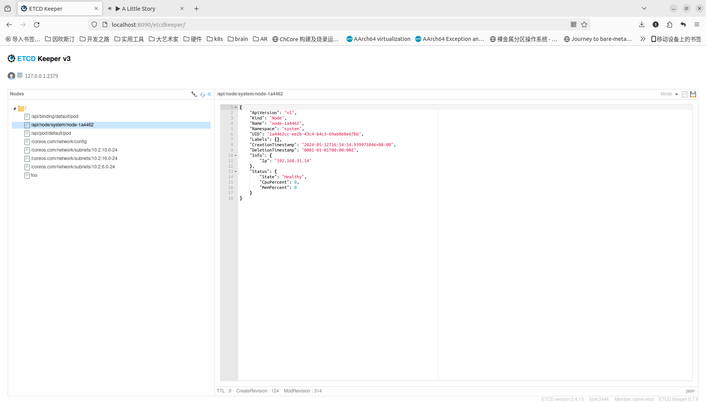

# 演示：Pod创建通路

展示通过kubectl创建pod，到kubelet创建pod，上报pod信息的流程

信息通路：kubectl->apiserver->scheduler->apiserver->kubelet

## 流程

通过kubectl创建pod

```
➜  build git:(kubelet) ✗ ./kubectl apply -f pod-example.yaml
ok
➜  build git:(kubelet) ✗ cat pod-example.yaml  
apiVersion: v1
kind: Pod
metadata:
  name: pod
  labels:
    app: myApp
spec:
  restartPolicy: Always
  containers:
    - name: viewer
      image: dplsming/nginx-fileserver:1.0
      ports:
        - containerPort: 80
          hostPort: 8888
      volumeMounts:
        - name: volume
          mountPath: /usr/share/nginx/html/files
    - name: downloader
      image: dplsming/aria2ng-downloader:1.0
      ports:
        - containerPort: 6800
          hostPort: 6800
        - containerPort: 6880
          hostPort: 6880
      volumeMounts:
        - name: volume
          mountPath: /data
  volumes:
    - name: volume
      hostPath:
        path: /pod
    - name: nfs-volume
      nfs:
        path: /exports
        server: 192.168.10.1
```

apiserver收到http请求，将pod信息存入etcd，并发布pod创建的通知

scheduler收到pod创建的通知，根据策略，创建binding对象，将pod调度到某个Node


上面的图片显示了apiserver收到来自kubectl对pod的post请求，以及scheduler对binding的post请求

apiserver将binding信息存入etcd，并发布binding创建的通知


上图为etcd中创建的bindign信息

Node上的kubelet收到binding创建的通知，在当前节点创建pod


kubelet将pod的运行信息定期上报给apiserver


etcd中的pod信息



etcd中的Node信息
